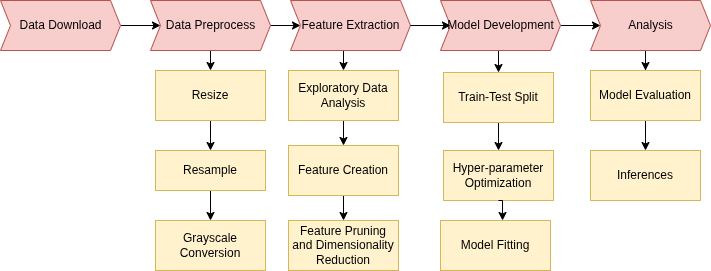

The goal of this project is to evaluate a broad range of machine learning models to detect brain tumors.  In particular, the role of model complexity and explainability are being explored across a wide range of machine learning algorithms.  Complexity here is not limited to model architecture, but also includes data resolution (gray scale vs RGB).  The project makes use of a wide range of machine learning libraries in Python including CV2, sklearn, tensor flow and others.  The brain tumor data was obtained from 
[Brain Tumor Research Repository] (https://www.kaggle.com/datasets/masoudnickparvar/brain-tumor-mri-dataset)

